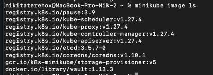
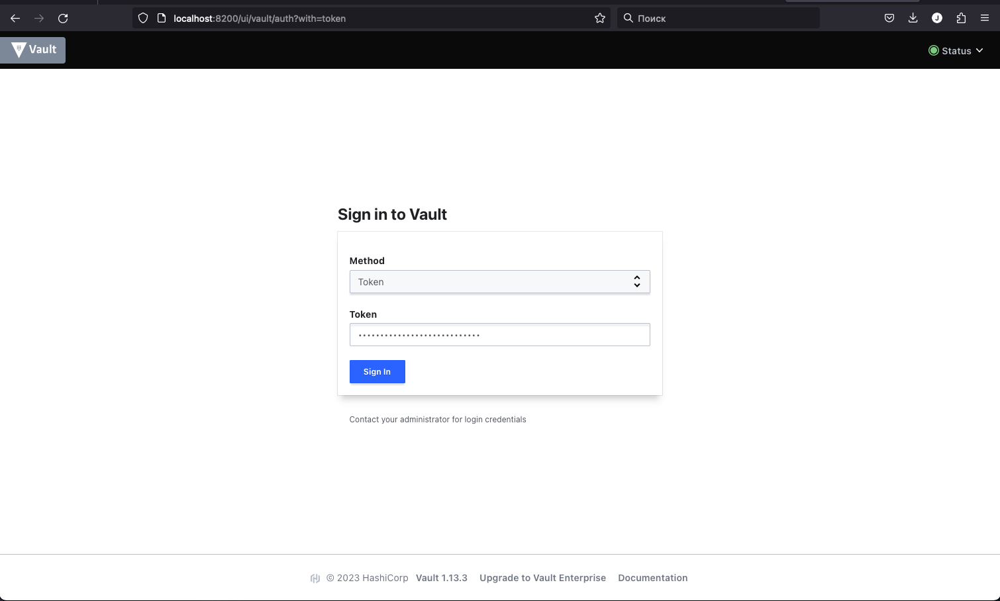

University: [ITMO University](https://itmo.ru/ru/)
Faculty: [FICT](https://fict.itmo.ru)
Course: [Introduction to distributed technologies](https://github.com/itmo-ict-faculty/introduction-to-distributed-technologies)
Year: 2023/2024
Group: K4111c
Author: Terekhov Nikita Gennadievich
Lab: Lab1
Date of create: 28.09.2023
Date of finished: ??.09.2023

Выполним следующие команды следуя инструкции
```
docker pull vault:1.13.3
docker images
```
Эти команды добавляют на нашей локальной машине в список образов образ нужного ПО - Vault.
Чтобы просмотреть список образов можем воспользоваться следующими командами:
```
docker images
#Или просмотреть в minikube список всех образов
minikube image ls
```


В конце нужный нам образ vault:1.13.3


```
minikube start
```
Эта команда запускает локальный кластер Kubernetes с использованием Minikube.
```
minikube kubectl apply -f deployment.yaml
```
Команда выше запускает контейнера в Kubernetes из созданого ранее YAML-манифеста
```
minikube kubectl -- run vault --image=vault:1.13.3
```
Эта команда создает и запускает контейнер с именем "vault" на локальном кластере Kubernetes. Контейнер будет основан на образе vault:1.13.3
```
minikube kubectl -- expose pod vault --type=NodePort --port=8200
```
В этой команде мы создаем службу для пода с именем "vault" и указываем флаг
который определяет тип службы, который будет создан. NodePort - это один из способов доступа к службе внутри кластера извне. Он выделяет порт на узлах кластера, который перенаправляет трафик на порт внутри службы.
>Мы можем проверить работает ли наш под:

```
minikube kubectl -- port-forward service/vault 8200:8200 & 
[1] 47025
kubectl logs vault
```
Далее запускаем в фоновом режиме порт-форвардинг

**Вывод**

**1. Что сейчас произошло и что сделали команды указанные ранее?**
>При помощи Docker мы выгрузили на локальный хост нужный образ контейнера hashiCorp.Vault, затем мы написали манифест-файл с указанием необходимых нам характеристик. В итоге применили инструкции манифеста и создали под (по инструкии из манифеста) с приложением vault  и запустили его в кластере minikube. Мы указали порт для прослушиваня приложения и благодаря этому смогли, перейдя по ссылке, воспользоваться интерфейсом vault. 

**2. Где взять токен для входа в Vault?**
>Для этого просмотрим логи используя команду:
>```
>minikube kubectl logs vault
>```
Пролистаем логи вниз и найдем строку начинающуюся с "Root Token:" после нее идет наш токен:

>и перейдем в vault по ссылке localhost:8200/ (поскольку мы пробрасывали порт 8200)
> 
> Далее нас авторизуемся используя полученный ранее токен, нас перебросит на следующую страницу:


В итоге мы получаем следующую UML диаграмму развертывания инфтраструктуры

