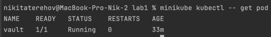
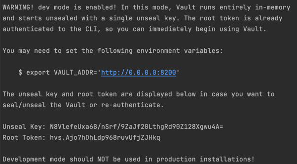
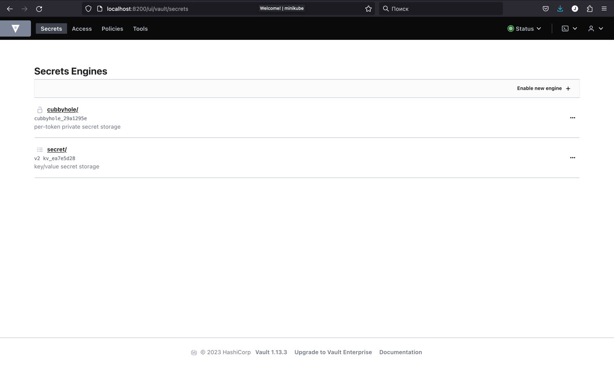
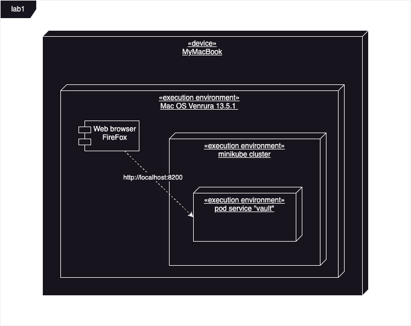

University: [ITMO University](https://itmo.ru/ru/)
Faculty: [FICT](https://fict.itmo.ru)
Course: [Introduction to distributed technologies](https://github.com/itmo-ict-faculty/introduction-to-distributed-technologies)
Year: 2023/2024
Group: K4111c
Author: Terekhov Nikita Gennadievich
Lab: Lab1
Date of create: 28.09.2023
Date of finished: ??.09.2023

Выполним следующие команды следуя инструкции
```
docker pull vault:1.13.3
docker images

minikube start
minikube kubectl -- run vault --image=vault:1.13.3
minikube kubectl -- expose pod vault --type=NodePort --port=8200
```

```
minikube kubectl -- port-forward service/vault 8200:8200 & #Запуск в фоновом режиме
[1] 47025
kubectl logs vault
```

**1. Что сейчас произошло и что сделали команды указанные ранее?**
>При помощи Docker мы выгрузили себе нужный образ контейнера hashiCorp.Vault, создали под и запустили его в кластере, используя конфигурацию deployment.yaml. Для того чтобы перейти перйти к интерфейсу vault нам надо пробросить порты чтобы под мог слушать запросы по адресу http://localhost:8200/ui/ 

**2. Где взять токен для входа в Vault?**
>Для этого просмотрим логи

и перейдем в vault


В итоге мы получаем следующую UML диаграмму развертывания инфтраструктуры

