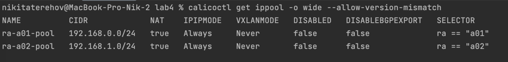
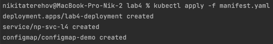
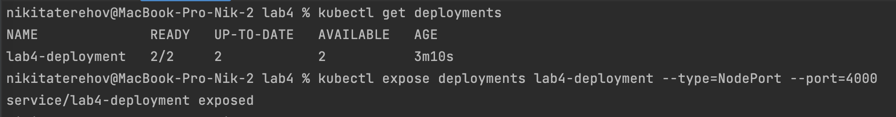
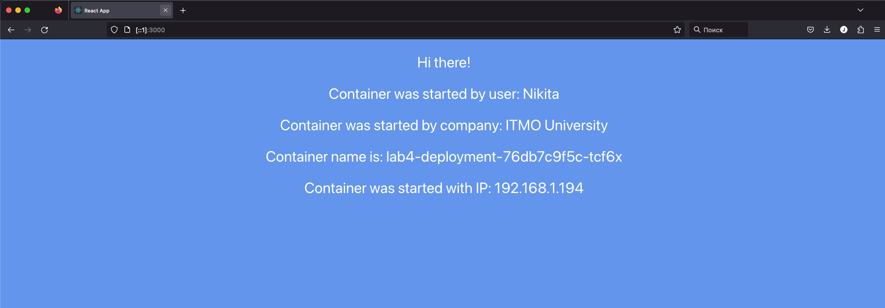
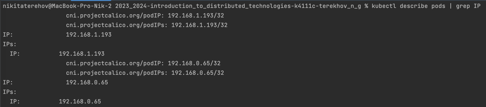
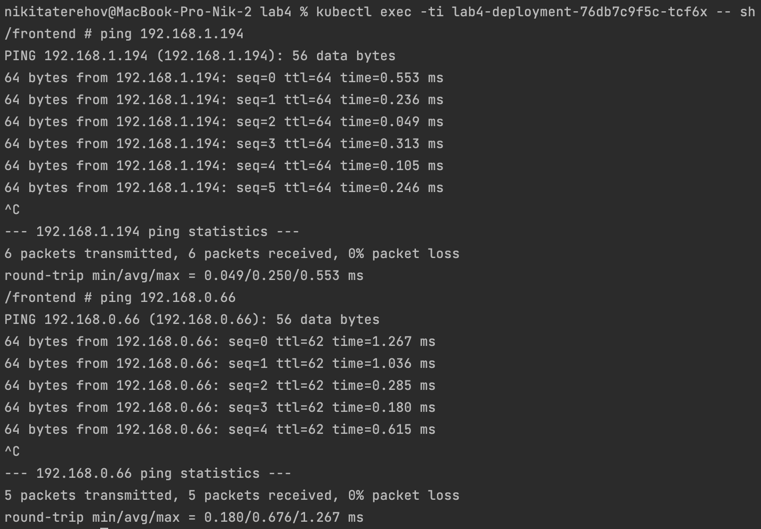

# Лабораторная работа №3 "Сертификаты и "секреты" в Minikube, безопасное хранение данных."
University: [ITMO University](https://itmo.ru/ru/)\
Faculty: [FICT](https://fict.itmo.ru)\
Course: [Introduction to distributed technologies](https://github.com/itmo-ict-faculty/introduction-to-distributed-technologies)\
Year: 2023/2024\
Group: K4111c\
Author: Terekhov Nikita Gennadievich\
Lab: Lab4\
Date of create: 16.11.2023\
Date of finished: 16.11.2023

### Цель работы
Познакомиться с CNI Calico и функцией `IPAM Plugin`, изучить особенности работы CNI и CoreDNS.

### Задание
- Запустить minikube c плагином `CNI=calico` и режимом работы `Multi-Node Clusters` одновременно, развернуть 2 ноды;
- Проверить работу CNI плагина Calico, количество нод;
- Указать `label` по признаку стойки или географического расположение (на свое усмотрение);
- Разработать манифест для Calico, который на основе указанных меток назначает IP адреса подам исходя из пулов IP адресов в манифесте.
- Создать деплоймент с двумя репликами контейнера [ifilyaninitmo/itdt-contained-frontend:master](https://hub.docker.com/repository/docker/ifilyaninitmo/itdt-contained-frontend) и передать переменные в эти реплики: `REACT_APP_USERNAME`, `REACT_APP_COMPANY_NAME`;
- Создать сервис, через который будет доступ в поды;
- Запустить в `minikube` режим проброса портов и подключиться к контейнерам через веб браузер;
- Проверить переменные `Container name` и `Container IP`. Если меняются, объяснить почему;
- Зайти в любой под и попробовать попинговать поды используя FQDN соседнего пода.


## 1. Ход работы
Ниже представлен пошаговый ход работы

### 1.1 Настройка среды
`minikube` в данной работе запускается с помощью следующей команды:
```bash
minikube start --network-plugin=cni --cni=calico --nodes 2 -p multinode-demo
```


После успешного запуска проверим, что создалось действительно две ноды с помощью команды
```bash
kubectl get nodes
```


Также не лишним будет проверить количество подов `calico`.
Их число должно совпадать с количеством нод.
```bash
kubectl get pods -l k8s-app=calico-node -A
```


### 1.3 Пометка нод

Каждую ноду в соответствии с заданием пометим по признаку стойки. Так, кажется, будет логичнее.

В соответствии с заданием помечается каждая нода по географическому расположению

Для назначения IP адресов в Calico необходимо написать манифест для IPPool ресурса.

С помощью IPPool можно создать IP-pool (блок IP-адресов), который выделяет IP-адреса только для узлов с определенной меткой (label).

С помощью следующей команды, назначаются метки узлам :

Пометка делается с помощью команды
```bash
kubectl label nodes multinode-demo ra=a01
kubectl label nodes multinode-demo-m02 ra=a02
```

## 2. Настройка calico
Далее из официальной документации Calico берется шаблон манифеста IPPool, прикреплен в директории - [lab4_ippool.yaml](/lab4/manifesty/lab4_ippool.yaml)
В его спеке есть следующие поля:
- `ipipMode` позволяет настроить режим IP-туннелирования.
  Судя по документации, есть два режима:
    - Режим `Always` включает инкапсуляцию пакетов для всего трафика от Calico-хоста к другим Calico-контейнерам и всем VM, имеющим IP в заданном IPPool.
    - Режим `CrossSubnet` включает инкапсуляцию только для того трафика, который ходит между сетями.
      Calico рекомендует использовать режим `CrossSubnet` в случае `ipipMode`, так как это уменьшит накладные расходы на инкапсуляцию.
      Но так как у нас работа маленькая, то можно и использовать режим `Always`.
- `natOutgoing` позволяет разрешить подам ходить во внешнюю сеть с помощью `NAT`.
  В данной работе эта настройка не особо играет роли, так как нам не требуется ходить во внешний интернет и наши поды не развернуты на железках.

- `nodeSelector` позволяет определить, какие ноды должны получать адрес из этого пула. В данном конкретном примере все ноды, находящиеся в "нулевой стойке", будут получать IP из этого пула.

Проверим у calico дефолтный ippool:
```bash
calicoctl get ippool -o wide --allow-version-mismatch
```


И удаляем его, заменяя на нашу конфигурацию:
```yaml
apiVersion: projectcalico.org/v3
kind: IPPool
metadata:
  name: ra-a01-pool
spec:
  cidr: 192.168.0.0/24
  ipipMode: Always
  natOutgoing: true
  nodeSelector: ra == "a01"

---

apiVersion: projectcalico.org/v3
kind: IPPool
metadata:
  name: ra-a02-pool
spec:
  cidr: 192.168.1.0/24
  ipipMode: Always
  natOutgoing: true
  nodeSelector: ra == "a02"
```


Проверяем созданные пулы:



## 3. Deployment и Service

И теперь мы создаем деплоймент с 2 репликами, NodePort и подключаем configMap как в предыдущих ЛР.
```yaml
apiVersion: apps/v1
kind: Deployment
metadata:
  name: lab4-deployment
  labels:
    app: lab4-frontend
spec:
  replicas: 2
  selector:
    matchLabels:
      app: frontend-l4
  template:
    metadata:
      labels:
        app: frontend-l4
    spec:
      containers:
        - name: frontend-l4
          image: ifilyaninitmo/itdt-contained-frontend:master
          env:
            - name: REACT_APP_USERNAME
              valueFrom:
                configMapKeyRef:
                  name: configmap-demo
                  key: user

            - name: REACT_APP_COMPANY_NAME
              valueFrom:
                configMapKeyRef:
                  name: configmap-demo
                  key: company

---
apiVersion: v1
kind: ConfigMap
metadata:
  name: configmap-demo
data:
  user: "Nikita"
  company: "ITMO University"
```



Видим что сервис, конфиг мапа и деплоймент созданы.

```bash
kubectl expose deployments lab4-deployment --type=NodePort --port=3000
```


И теперь пробросим порты
```bash
kubectl port-forward lab4-deployment 3000:3000
```
и переходим по локальному хосту на порт:


## 4. Ping подов
Для начала получим все ip-адреса контейнеров калико.
Для этого используем перенаправление потока через grep чтобы быстро найти нужную информацию: 
```bash
 kubectl describe pods | grep IP
```


Можем пропинговать двумя способами контейнеры:
### 4.1 nslookup
```bash
kubectl exec lab4-deployment-76db7c9f5c-tcf6x -- nslookup 192.168.1.194
```

### 4.2 sh, ping
Сначала перейдем в управление контейнера и пропишем команду ping <ip-адрес>
```bash
kubectl exec -ti lab4-deployment-76db7c9f5c-tcf6x -- sh
```
Результат:


### 5. Диаграмма развертывания


